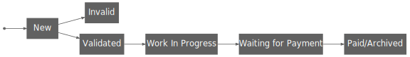

# The Case for the Typestate Pattern - Actually It Depends
:source-highlighter: highlightjs
:highlightjs-languages: rust

So far, I introduced several approaches to designing types to represent states in Rust.
I presented them in a clear order from worst to best, but this is not generally true.

The reason why the typestate pattern suited the algorithm so well is mostly because the state transitions looked like this:

Note that most states are followed by exactly a single other state - the Invalid state even represents an early exit which was easy to model with a `return` (or a `?`).

How would this look if the states looked more like this?
 

TODO

